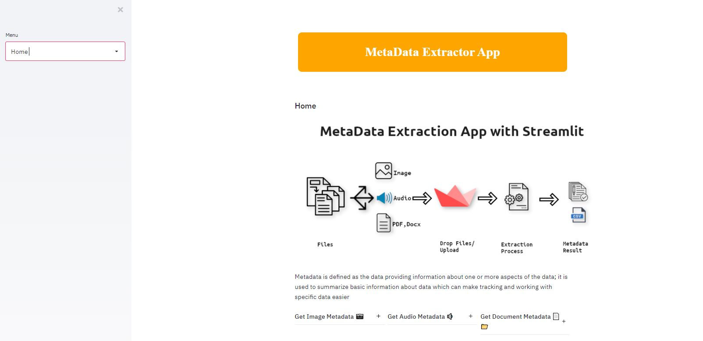

# MetaData Overview
Metadata is data that describes other data. Meta is a prefix that -- in most information technology usages -- means "an underlying definition or description." 
Metadata summarizes basic information about data, which can make finding and working with particular instances of data easier
Metadata can be used for:-

Images

Videos

Spreadsheets

Web pages

# Meta Data Extractor App
The Meta data Extractor is created as a part of Data Science Web App to know the the description of various files such as Images, Audio, Document Files(PDF,Docx), Images for supplying various details like author, date created, date modified and file size

# Features
Drag & Drop Feature for file uploading on the running app
Metadata of:- 

Images(Jpeg,PNG)

Doc Files(PDF,working on docx)

Audio files(Mp3,OGG)

Anlytics Monitoring technique to define the volume of files uploaded

You can also download metadata in .CSV format in your local system

# Downloading the source code
Clone the Repository (Recommended) If you have git installed, this is a recommended approach as you can quickly sync and stay up to date with the latest version. This is also a preferred way of downloading the code if you decide to contribute to the project.

$ git clone https://github.com/aarkeshsharma/MetaData-App.git Download the code as a zip file

# Build & Run
Before we dive into building and running a fully featured Web App,ensure that you've read the following.

This is a Web App running in Streamlit!

U should have a VS code for smooth running

Create a Virtual env with all the scripts activated

Download pip install -r requirement.txt

# Author
aarkeshsharma

# License
Copyright (c) 2021-present, Aarkesh Sharma aarkeshsharma@gmail.com

# Your reviews & comments are valuable
# Thank You!!
